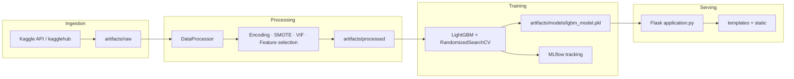
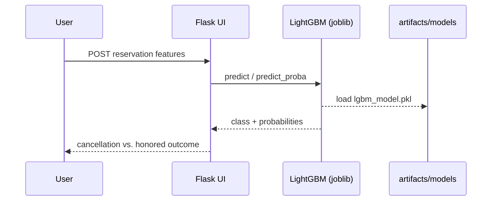
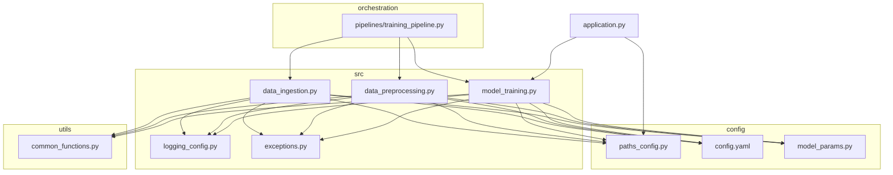

# Hotel Reservation Cancellation Prediction

**Academic machine learning project** developed in the context of **ET-287 — Signal Processing with Neural Networks** (*Processamento de Sinais com Redes Neurais*), Instituto Tecnológico de Aeronáutica (ITA).

End-to-end pipeline for binary classification of hotel booking outcomes: predicting whether a reservation will be **honored** or **canceled**, with experiment tracking (MLflow) and a Flask-based inference interface.

---

## Table of Contents

- [Abstract](#abstract)
- [Problem Statement](#problem-statement)
- [Dataset](#dataset)
- [System Architecture](#system-architecture)
- [Repository Structure](#repository-structure)
- [Technology Stack](#technology-stack)
- [Prerequisites](#prerequisites)
- [Installation](#installation)
- [Configuration](#configuration)
- [Reproducing the Pipeline](#reproducing-the-pipeline)
- [Model Serving (Web Application)](#model-serving-web-application)
- [Experiment Tracking (MLflow)](#experiment-tracking-mlflow)
- [Exploratory Analysis](#exploratory-analysis)
- [Artifacts and Logs](#artifacts-and-logs)
- [Academic Context](#academic-context)

---

## Abstract

This repository implements a reproducible data-science workflow spanning data ingestion, preprocessing, feature engineering, model training, and deployment. A **LightGBM** classifier is tuned via randomized search and evaluated on held-out data. The deployed model consumes ten engineered features and returns class labels with probability estimates through a web front end aligned with the institutional branding of ITA and the learning objectives of ET-287.

---

## Problem Statement

Online reservation platforms have increased booking flexibility—and cancellation rates. Hotels and hospitality operators (including short-term rental ecosystems) face revenue risk from no-shows and late cancellations. This project addresses three applied perspectives:

| Perspective | Objective |
|-------------|-----------|
| **Revenue management** | Support capacity and overbooking decisions by forecasting cancellation likelihood. |
| **Targeted marketing** | Characterize guest profiles associated with honored stays for segmentation and personalization. |
| **Risk & fraud detection** | Surface booking patterns that may indicate abusive or high-risk behavior. |

The learning task is **binary classification** on tabular reservation attributes, framed analogously to multichannel signal representation and decision-boundary learning in neural and statistical models.

---

## Dataset

- **Source:** [Hotel Reservations Classification Dataset](https://www.kaggle.com/datasets/ahsan81/hotel-reservations-classification-dataset) (Kaggle, `ahsan81`)
- **Scale:** ~36,000 records; 19 raw attributes including `booking_status` (target)
- **Context:** Bookings span multiple channels and time horizons; cancellations are influenced by lead time, pricing, and segment type, among other factors.

Raw and processed splits are stored under `artifacts/` after ingestion and preprocessing.

---

## System Architecture

### End-to-end ML pipeline



### Deployment and inference flow



### Module dependency overview



---

## Repository Structure

```
24.hotel_revervation_ml/
├── application.py              # Flask inference server
├── main.py                     # Project scaffolding utility
├── pyproject.toml              # Dependencies and build (uv)
├── uv.lock                     # Locked dependency versions
│
├── config/
│   ├── config.yaml             # Ingestion & preprocessing parameters
│   ├── model_params.py         # LightGBM search space & CV settings
│   └── paths_config.py         # Centralized path constants
│
├── src/
│   ├── data_ingestion.py       # Kaggle / GCP data download & split
│   ├── data_preprocessing.py   # Cleaning, encoding, SMOTE, feature selection
│   ├── model_training.py       # Training, evaluation, MLflow logging
│   ├── logging_config.py       # File-based logging
│   └── exceptions.py           # Domain-specific errors
│
├── utils/
│   └── common_functions.py     # YAML I/O, data loading helpers
│
├── pipelines/
│   └── training_pipeline.py    # Sequential orchestration of all stages
│
├── notebooks/
│   └── notebook.ipynb          # Exploratory analysis & methodology (ET-287)
│
├── templates/
│   └── index.html              # Inference UI (Jinja2)
├── static/
│   ├── css/styles.css
│   ├── js/app.js
│   └── images/ITA_logo.png
│
├── artifacts/
│   ├── raw/                    # raw.csv, train.csv, test.csv
│   ├── processed/              # Processed_train/test.csv, mappings.json
│   └── models/                 # lgbm_model.pkl (deployed artifact)
│
└── logs/                       # Daily execution logs
```

Generated at runtime (typically git-ignored in production setups): `mlflow.db`, `mlartifacts/`, `mlruns/`, `.venv/`.

---

## Technology Stack

| Layer | Technologies |
|-------|----------------|
| Language | Python ≥ 3.12 |
| Package manager | [uv](https://github.com/astral-sh/uv) |
| Data | pandas, NumPy |
| ML | scikit-learn, LightGBM, XGBoost, imbalanced-learn (SMOTE) |
| Statistics | statsmodels (VIF) |
| Tracking | MLflow |
| Serving | Flask |
| Ingestion | kagglehub |
| Visualization (notebook) | matplotlib, seaborn |

---

## Prerequisites

1. **Python 3.12+**
2. **[uv](https://docs.astral.sh/uv/getting-started/installation/)** for environment and dependency management
3. **Kaggle credentials** (for data ingestion via `kagglehub`):
   - API token at `~/.kaggle/kaggle.json`, or
   - Environment variable `KAGGLE_API_TOKEN`
   - Accept dataset terms on the [Kaggle dataset page](https://www.kaggle.com/datasets/ahsan81/hotel-reservations-classification-dataset)

---

## Installation

Clone the repository and install dependencies from the project root:

```bash
git clone <repository-url>
cd 24.hotel_revervation_ml

uv sync
```

This creates `.venv/` and installs all packages declared in `pyproject.toml` according to `uv.lock`.

Verify the environment:

```bash
uv run python --version
```

---

## Configuration

| File | Purpose |
|------|---------|
| `config/config.yaml` | Kaggle dataset handle, train/test ratios, column lists, skewness and feature-selection thresholds |
| `config/paths_config.py` | Paths to raw, processed, and model artifacts |
| `config/model_params.py` | LightGBM hyperparameter distributions and `RandomizedSearchCV` settings |

Edit `config.yaml` to change ingestion source (Kaggle vs. GCP bucket fields) or preprocessing thresholds without modifying pipeline code.

---

## Reproducing the Pipeline

All commands below assume the **repository root** as the current working directory.

### Option A — Full orchestration (recommended)

Runs ingestion → preprocessing → training in sequence:

```bash
uv run pipelines/training_pipeline.py
```

### Option B — Stage-by-stage execution

**1. Data ingestion** (download from Kaggle and create train/test split):

```bash
uv run src/data_ingestion
```

**2. Data preprocessing** (encoding, balancing, feature selection):

```bash
uv run src/data_preprocessing
```

**3. Model training** (hyperparameter search, evaluation, MLflow logging):

```bash
uv run src/model_training
```

### Expected outputs

| Stage | Primary outputs |
|-------|-----------------|
| Ingestion | `artifacts/raw/raw.csv`, `train.csv`, `test.csv` |
| Preprocessing | `artifacts/processed/Processed_train.csv`, `Processed_test.csv`, `mappings.json` |
| Training | `artifacts/models/lgbm_model.pkl`, MLflow run metadata |

---

## Model Serving (Web Application)

Load the serialized model and start the Flask development server:

```bash
uv run application.py
```

Open **http://127.0.0.1:5000** in a browser. The interface accepts ten features consistent with the processed training schema and displays predicted class probabilities.

> **Port conflict:** Both Flask (default) and MLflow UI use port `5000`. Stop MLflow before starting the web app, or change the port in `application.py` (e.g. `port=5001`).

---

## Experiment Tracking (MLflow)

Training runs log parameters, metrics, and artifacts via MLflow. To inspect experiments locally:

```bash
uv run python -m mlflow ui --backend-store-uri sqlite:///./mlflow.db --default-artifact-root ./mlartifacts
```

Then navigate to **http://127.0.0.1:5000** (if not used by Flask) and review logged runs.

**Windows / PowerShell note:** stderr messages from MLflow may appear in red without indicating failure; confirm the line `Uvicorn running on http://127.0.0.1:5000`.

Stop the UI with `Ctrl+C` before running `uv sync` or reinstalling the environment to avoid file-lock errors on Windows.

---

## Exploratory Analysis

The Jupyter notebook `notebooks/notebook.ipynb` documents:

- Problem motivation and use cases
- Exploratory data analysis (distributions, correlation, VIF)
- Model comparison and selection rationale
- Connection to ET-287 themes (feature spaces, generalization, experiment discipline)

When executing the notebook, run the setup cell that sets the project root on `sys.path` (or launch Jupyter from the repository root) so `config.paths_config` imports resolve correctly.

---

## Artifacts and Logs

| Path | Description |
|------|-------------|
| `artifacts/raw/` | Raw and split datasets |
| `artifacts/processed/` | Model-ready training and test matrices |
| `artifacts/models/lgbm_model.pkl` | Production classifier (joblib) |
| `logs/log_YYYY-MM-DD.log` | Structured pipeline logs |
| `mlflow.db` | SQLite tracking store (when using default MLflow backend) |
| `mlartifacts/` | Run artifacts referenced by MLflow |

---

## Academic Context

This project was developed for **ET-287 — Signal Processing with Neural Networks** at the **Instituto Tecnológico de Aeronáutica (ITA)**. Although the deployed estimator is gradient-boosted (LightGBM), the workflow emphasizes practices central to statistical and neural learning courses:

- Representation of heterogeneous inputs as fixed-length feature vectors
- Control of redundancy (correlation / VIF) and class imbalance (SMOTE)
- Cross-validated hyperparameter search and held-out evaluation
- Reproducible experiment logging and model deployment

The web interface presents the work in formal academic English and situates the application within hospitality analytics and ITA institutional identity.

---

## License

Academic / educational use. Dataset subject to [Kaggle dataset terms](https://www.kaggle.com/datasets/ahsan81/hotel-reservations-classification-dataset). Specify institutional or course attribution when redistributing derivatives.
